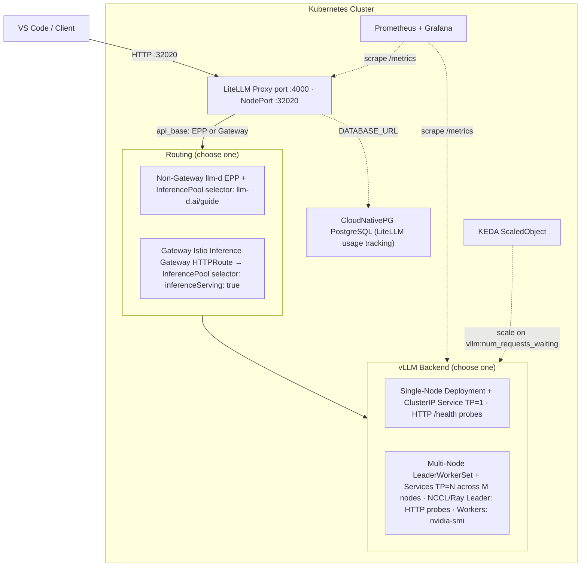

# LLMD-Stack

The goal is to deploy a Helm chart for a multi-tenant, multi-model developer architecture for code generation with LiteLLM, llm-d, vLLM backends and open weights models.

---

### Key Components

| Component | Role |
|-----------|------|
| **LiteLLM** | OpenAI-compatible proxy — auth, rate limiting, model fallbacks, usage tracking |
| **llm-d Gateway** | Inference Gateway + Endpoint Picker (EPP) — smart routing based on queue depth, KV-cache utilization, prefix cache hit rate |
| **vLLM** | High-throughput LLM inference engine — serves open-weight models |
| **LeaderWorkerSet (LWS)** | Kubernetes API for multi-node model serving — leader serves API, workers provide GPU compute. Uses vLLM distributed executor for cross-node tensor parallelism |
| **CloudNativePG** | PostgreSQL operator — LiteLLM usage persistence |
| **ServiceMonitor** | Prometheus scrape config for vLLM metrics |
| **KEDA** | Event-driven autoscaler — scales vLLM pods based on `vllm:num_requests_waiting` queue depth |
| **Istio** | Service mesh — Inference Extension for llm-d gateway integration |

## Architecture



# Install Chart Dependencies

### CloudnativePG Operator
The built-in database for LiteLLM uses postgres which we deploy through the cnpg operator. Set `litellm.extraEnv.DATABASE_URL: "postgresql://<user>:<password>@<host>:<port>/<dbname>"` if you have you're own instance hosted elsewhere.
```
helm repo add cnpg https://cloudnative-pg.github.io/charts
helm repo update
helm dependency update
helm upgrade -f --install test --namespace cloudnative-pg --create-namespace   cnpg/cloudnative-pg
```

### LeadWorkerSet & Nvidia Network Operator (Required for Multi-Node Inference)
Exposes the infiniband interfaces using the `rdmaSharedDevicePlugin`.
```
# Install LeadWorkerSet CRD
kubectl apply --server-side -f https://github.com/kubernetes-sigs/lws/releases/download/v0.9.0/manifests.yaml
kubectl wait deploy/lws-controller-manager -n lws-system --for=condition=available --timeout=5m

# Install Nvidia Network Operator (To expose infiniband interfaces to pods)
helm repo add nvidia https://helm.ngc.nvidia.com/nvidia
helm repo update
helm install -f ./values-network-operator.yaml network-operator nvidia/network-operator -n nvidia-network-operator --create-namespace --wait 
```

### Install KEDA (Required if you want to use Scale-To-Zero autoscaling)
```
helm repo add kedacore https://kedacore.github.io/charts
helm install keda kedacore/keda --namespace keda --create-namespace
```

### Install Istio (Required if you want to use an API Gateway to expose LiteLLM)
```
# Kubernetes Gateway API CRDs 
kubectl apply -f https://github.com/kubernetes-sigs/gateway-api-inference-extension/releases/download/v1.5.0/v1-manifests.yaml

# Istio Gateway
microk8s enable dns
microk8s enable hostpath-storage
microk8s enable rbac

# Enable MetalLB so your Envoy Gateway can provision external IPs
# Replace the IP range with a free block on your local network/subnet
microk8s enable metallb:192.168.0.240-192.168.0.250

# Add the official Istio Helm repo
helm repo add istio https://istio-release.storage.googleapis.com/charts
helm repo update

# 1. Install the base CRDs for Istio
helm install istio-base istio/base -n istio-system --create-namespace

# 2. Install istiod with the Inference Extension explicitly turned ON
helm install istiod istio/istiod -n istio-system \
  --set meshConfig.defaultConfig.proxyMetadata.ENABLE_GATEWAY_API_INFERENCE_EXTENSION="true" \
  --set pilot.env.ENABLE_GATEWAY_API_INFERENCE_EXTENSION="true"
```

# Install Helm Chart
```
helm upgrade --install test . \
  -f values.yaml \
  -f values-singletest.yaml \
  --namespace llmd-stack
  --force-conflicts

kubectl get pods -n llmd-stack

# Wait for vLLM containers to start
kubectl logs -f -n llmd-stack -l app.kubernetes.io/component=vllm
```

### SingleNode Test
```
export IP=$(kubectl get pod -n llmd-stack -l app.kubernetes.io/component=vllm -o jsonpath='{.items[0].status.podIP}')
curl -X POST http://${IP}:8000/v1/chat/completions \
    -H "Authorization: Bearer password" \
    -H 'Content-Type: application/json' \
    -d '{
        "messages": [
            {"role": "user", "content": "How are you today?"}
        ]
    }' | jq
```

### MultiNode LeadWorkerSet Test
```
export IP=$(kubectl get service test-llmd-stack-model-gemma-4-26b-a4b-it-svc -n llmd-stack -o jsonpath='{.spec.clusterIP}')
curl -X POST http://${IP}:8000/v1/chat/completions \
    -H "Authorization: Bearer password" \
    -H 'Content-Type: application/json' \
    -d '{
        "messages": [
            {"role": "user", "content": "How are you today?"}
        ]
    }' | jq
```

### llm-d standalone router test
```
export IP=$(kubectl get service test-epp -n llmd-stack -o jsonpath='{.spec.clusterIP}')
curl -X POST http://${IP}/v1/chat/completions \
    -H "Authorization: Bearer password" \
    -H 'Content-Type: application/json' \
    -d '{
        "model": "Qwen/Qwen2.5-0.5B-Instruct",
        "messages": [
            {"role": "user", "content": "How are you today?"}
        ]
    }' | jq

# View endpoints
kubectl get endpointslices -n llmd-stack -l llm-d.ai/guide=optimized-baseline
```

### LiteLLM Test
```
curl http://localhost:32020/v1/chat/completions \
  -H "Content-Type: application/json" \
  -H "Authorization: Bearer password" \
  -d '{
    "model": "Qwen/Qwen2.5-0.5B-Instruct",
    "messages": [{"role": "user", "content": "Say hello!"}]
  }' | jq

curl http://192.168.0.30:32020/metrics \
  -H "Authorization: Bearer password" 
```

### LiteLLM UI
http://192.168.0.30:32020/ui

### llm-d istio gateway test
```
kubectl describe gateway test-inference-gateway -n llmd-stack
kubectl describe httproute test-llmd-stack-litellm -n llmd-stack

export IP=$(kubectl get gateways test-inference-gateway -n llmd-stack -o jsonpath='{.status.addresses[0].value}')
curl -X POST http://${IP}/v1/chat/completions \
    -H 'Content-Type: application/json' \
    -H "Authorization: Bearer password" \
    -d '{
        "model": "Qwen/Qwen2.5-0.5B-Instruct",
        "messages": [
            {"role": "user", "content": "How are you today?"}
        ]
    }' | jq
```

### Print VSCode Models JSON
```
helm template llmd-stack . -f values-singletest.yaml --show-only templates/copilot-configmap.yaml
```

## Prometheus/Grafana
I provided a separate prometheus/grafana chart that bundles some of the official dashboards for LiteLLM and llm-d. Hint: They aren't that great but it's a start.

If you wish to use an external prometheus instance for KEDA metrics set `vllm.autoscaling.prometheusServerAddress`
```
cd prom-g
helm repo add prometheus-community https://prometheus-community.github.io/helm-charts
helm install prom-crds prometheus-community/prometheus-operator-crds \
  --namespace llmd-stack \
  --create-namespace
helm repo update
helm dependency update
helm template .

helm upgrade --install dev .   -f values.yaml --namespace llmd-stack
```
### Grafana
http://192.168.0.30:32002/login
Username: admin
Password: prom-operator

### Prometheus
http://192.168.0.30:32001

## Benchmark
### aiperf
```
pip install aiperf
aiperf profile \
    -m "Qwen/Qwen2.5-0.5B-Instruct" \
    -u http://192.168.0.30:32020 \
    --api-key password \
    --endpoint-type chat \
    --synthetic-input-tokens-mean 2000 \
    --synthetic-input-tokens-stddev 1000 \
    --output-tokens-mean 1000 \
    --output-tokens-stddev 200 \
    --use-server-token-count \
    --random-seed $((RANDOM)) \
    --streaming \
    --concurrency 16 \
    --request-count 1000
    --warmup-request-count 5 

aiperf profile \
    -m "google/gemma-4-26B-A4B-it" \
    -u http://192.168.0.30:32020 \
    --api-key password \
    --endpoint-type chat \
    --synthetic-input-tokens-mean 2000 \
    --synthetic-input-tokens-stddev 1000 \
    --output-tokens-mean 1000 \
    --output-tokens-stddev 200 \
    --use-server-token-count \
    --random-seed $((RANDOM)) \
    --streaming \
    --concurrency 16 \
    --request-count 1000
    --warmup-request-count 5 
```

Run with public dataset
```
aiperf profile \
    --model Qwen/Qwen2.5-0.5B-Instruct \
    --endpoint-type chat \
    --header 'Authorization: Bearer password' \
    --streaming \
    --url http://192.168.0.30:32020 \
    --public-dataset instruct_coder \
    --random-seed $RANDOM \
    --concurrency 16 \
    --request-count 200
```

Monitor vllm instances
```
sum(vllm:num_requests_running) by (pod)
sum(vllm:num_requests_waiting) by (pod)
```

Monitor llm-d
```
sum(llm_d_epp_flow_control_queue_size) by (pod)
```

## Troubleshooting

Node stuck in `NotReady` from `kubectl get nodes -A`
```
sudo microk8s stop
sudo microk8s start
```

Error: unable to continue with install: CustomResourceDefinition "backups.postgresql.cnpg.io" in namespace "" exists and cannot be imported into the current release: invalid ownership metadata; annotation validation error: key "meta.helm.sh/release-namespace" must equal "llmd-stack": current value is "llmd-stack"
```
kubectl get crds -o name | grep cnpg.io | xargs kubectl delete
```

Error: The table `public.LiteLLM_UserTable` does not exist in the current database.
```
kubectl delete pod -n llmd-stack test-llmd-stack-litellm-78dbffd9f-ztqkj
```

Show logs by label:
```
# llm-d epp gateway
kubectl logs -f -n llmd-stack -l llm-d-router-gateway=test-epp -c epp

# vllm 
kubectl logs -f -n llmd-stack -l app.kubernetes.io/component=vllm
```

PostgreSQL database 
```
kubectl exec -ti -c postgres test-litellm-db-cluster-1 -n llmd-stack -- psql -c '\du'
kubectl exec -ti -c postgres test-litellm-db-cluster-1 -n llmd-stack -- psql -c '\l'
```

# Chart Cleanup 
```
helm uninstall test -n llmd-stack

# Prometheus/Grafana Chart
helm uninstall dev -n llmd-stack

kubectl delete pods --all -n llmd-stack
```

## k8s Container Registry
```
microk8s enable registry:size=200Gi

# Allow http registry in microk8s
sudo mkdir -p /var/snap/microk8s/current/args/certs.d/localhost:32000   
sudo vi /var/snap/microk8s/current/args/certs.d/localhost:32000/hosts.toml
server = "http://localhost:32000"

[host."http://localhost:32000"]
  capabilities = ["pull", "resolve"]
  skip_verify = true

microk8s stop && microk8s start

# List containers in registry
curl -X GET http://localhost:32000/v2/_catalog
```

## Improving Cold Start Times

Add the `--load-format=instanttensor`  to the model's `extraArgs` to decrease safetensors load time 10-30x. Requires a custom `docker/Dockerfile` image to be built and pushed to the container repository.
```
# Build the container image
docker build -t localhost:32000/vllm:instanttensors .

# Push the image to the local registry
docker push localhost:32000/vllm:instanttensors
```

Then add this to your `models` values
```
    image:
      repository: localhost:32000/vllm
      tag: instanttensors
```

# DGX Spark / GB10 Specific
Create image from running container build using https://github.com/eugr/spark-vllm-docker
```
docker commit \
  vllm_node \
  localhost:32000/vllm-spark:deepseek-v4-flash-dspark
docker push localhost:32000/vllm-spark:deepseek-v4-flash-dspark
```

(Doesn't work) Build for https://github.com/jasl/vllm/tree/codex/ds4-sm120-min-enable
```
DOCKER_BUILDKIT=1 docker build . \
  --file docker/Dockerfile \
  --target vllm-openai \
  --build-arg torch_cuda_arch_list="12.1" \
  --build-arg max_jobs=$(nproc) \
  -t localhost:32000/vllm-spark:deepseek-v4-flash-dspark-jasl
docker push localhost:32000/vllm-spark:deepseek-v4-flash-dspark-jasl
```