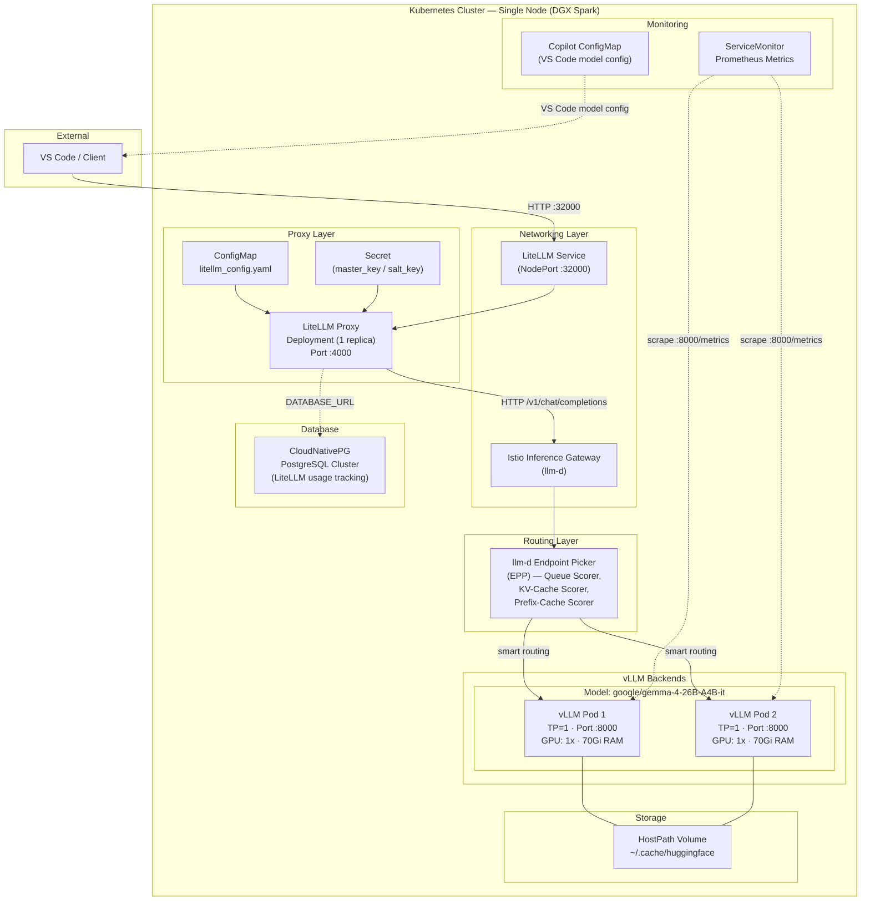
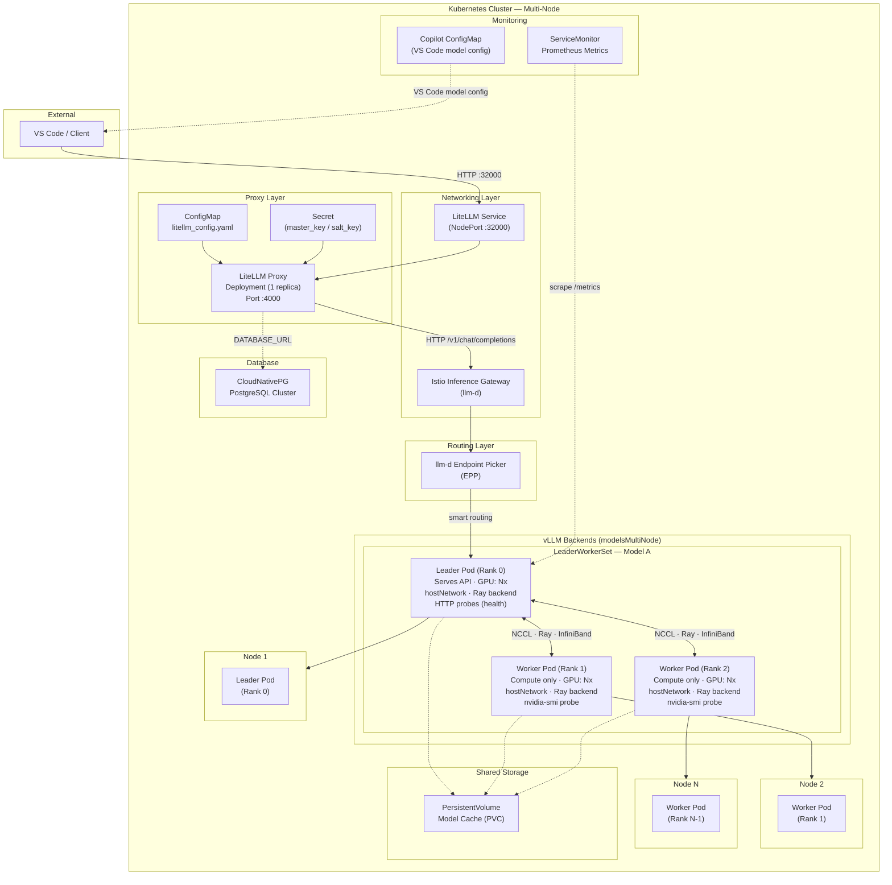

# LLMD-Stack

The goal is to deploy a Helm chart for a multi-tenant, multi-model developer architecture for code generation with LiteLLM, llm-d, vLLM backends and open weights models.

## Architecture

### Single-Node Deployment (`values-single.yaml`)

Designed for a single DGX Spark (128GB unified memory). All vLLM model pods run with TP=1 on the same node, fronted by the llm-d Inference Gateway (Istio) for smart routing.



**Data flow:** Client → LiteLLM (auth, routing, fallbacks) → Istio Inference Gateway → llm-d EPP (smart endpoint selection based on queue depth, KV-cache hit rate, prefix cache) → vLLM pod (inference) → response back.

---

### Multi-Node Deployment (`values-multinode.yaml`)

Designed for multiple DGX Spark nodes or a GPU cluster. Models span nodes using tensor parallelism via Kubernetes LeaderWorkerSet (LWS) with Ray distributed executor and InfiniBand/hostNetwork for GPU-to-GPU communication.



**Data flow:** Client → LiteLLM → Istio Inference Gateway → llm-d EPP → LWS Leader Pod (serves API) → distributed inference across leader + workers via Ray/NCCL over hostNetwork. Workers are compute-only with no HTTP server — they connect back to the leader via `VLLM_LEADER_ADDR` (leader's `status.podIP`, workers' `status.hostIP`).

---

### Key Components

| Component | Role |
|-----------|------|
| **LiteLLM** | OpenAI-compatible proxy — auth, rate limiting, model fallbacks, usage tracking |
| **llm-d Gateway** | Inference Gateway + Endpoint Picker (EPP) — smart routing based on queue depth, KV-cache utilization, prefix cache hit rate |
| **vLLM** | High-throughput LLM inference engine — serves open-weight models |
| **LeaderWorkerSet (LWS)** | Kubernetes API for multi-node model serving — leader serves API, workers provide GPU compute. Uses Ray distributed executor for cross-node tensor parallelism |
| **CloudNativePG** | PostgreSQL operator — LiteLLM usage persistence |
| **ServiceMonitor** | Prometheus scrape config for vLLM metrics |
| **Istio** | Service mesh — Inference Extension for llm-d gateway integration |

## TODO
    - Use llm-d gateway instead of standalone
    - 

## Install Dependencies
```
kubectl apply -f https://github.com/kubernetes-sigs/gateway-api-inference-extension/releases/download/v1.5.0/v1-manifests.yaml

helm repo add cnpg https://cloudnative-pg.github.io/charts
helm repo update
helm dependency update

# Install CloudNativePG Operator
helm upgrade -f --install test --namespace cloudnative-pg --create-namespace   cnpg/cloudnative-pg
```

### Required for Multi-Node Inference
```
# Install LeadWorkerSet CRD
kubectl apply --server-side -f https://github.com/kubernetes-sigs/lws/releases/download/v0.9.0/manifests.yaml
kubectl wait deploy/lws-controller-manager -n lws-system --for=condition=available --timeout=5m

# Install Nvidia Network Operator (To expose infiniband interfaces to pods)
helm repo add nvidia https://helm.ngc.nvidia.com/nvidia
helm repo update

helm install -f ./values-network-operator.yaml network-operator nvidia/network-operator -n nvidia-network-operator --create-namespace --wait 
```


### Required if you want to use the Gateway to expose LLM-d
```
# (Optional) Istio Gateway
microk8s enable dns
microk8s enable hostpath-storage
microk8s enable rbac

# Enable MetalLB so your Envoy Gateway can provision external IPs
# Replace the IP range with a free block on your local network/subnet
microk8s enable metallb:192.168.0.240-192.168.0.250

# Add the official Istio Helm repo
helm repo add istio https://istio-release.storage.googleapis.com/charts
helm repo update

# 1. Install the base CRDs for Istio
helm install istio-base istio/base -n istio-system --create-namespace

# 2. Install istiod with the Inference Extension explicitly turned ON
helm install istiod istio/istiod -n istio-system \
  --set meshConfig.defaultConfig.proxyMetadata.ENABLE_GATEWAY_API_INFERENCE_EXTENSION="true" \
  --set pilot.env.ENABLE_GATEWAY_API_INFERENCE_EXTENSION="true"
```

## Install Helm Chart
```
helm upgrade --install test . \
  -f values.yaml \
  -f values-singletest.yaml \
  --namespace llmd-stack

kubectl get pods -n llmd-stack

# Wait for vLLM containers to start
kubectl logs -f -n llmd-stack -l app.kubernetes.io/component=vllm
```

Use when updating/changing chart
```
kubectl rollout restart deployment/test-llmd-stack-litellm -n llmd-stack
```

# SingleNode Test
```
export IP=$(kubectl get pod -n llmd-stack -l app.kubernetes.io/component=vllm -o jsonpath='{.items[0].status.podIP}')
curl -X POST http://${IP}:8000/v1/chat/completions \
    -H 'Content-Type: application/json' \
    -d '{
        "model": "google/gemma-4-26B-A4B-it",
        "messages": [
            {"role": "user", "content": "How are you today?"}
        ]
    }' | jq
```

# MultiNode LeadWorkerSet Test
```
export IP=$(kubectl get service test-llmd-stack-model-gemma-4-26b-a4b-it-svc -n llmd-stack -o jsonpath='{.spec.clusterIP}')
curl -X POST http://${IP}:8000/v1/chat/completions \
    -H "Authorization: Bearer password" \
    -H 'Content-Type: application/json' \
    -d '{
        "model": "google/gemma-4-26B-A4B-it",
        "messages": [
            {"role": "user", "content": "How are you today?"}
        ]
    }' | jq
```

# llm-d standalone router test
```
export IP=$(kubectl get service test-epp -n llmd-stack -o jsonpath='{.spec.clusterIP}')
curl -X POST http://${IP}/v1/chat/completions \
    -H "Authorization: Bearer password" \
    -H 'Content-Type: application/json' \
    -d '{
        "model": "google/gemma-4-26B-A4B-it",
        "messages": [
            {"role": "user", "content": "How are you today?"}
        ]
    }' | jq
```

# llm-d istio gateway test
```
export IP=$(kubectl get gateways test-inference-gateway -n llmd-stack -o jsonpath='{.status.addresses[0].value}')
curl -X POST http://${IP}/v1/chat/completions \
    -H 'Content-Type: application/json' \
    -d '{
        "model": "google/gemma-4-26B-A4B-it",
        "messages": [
            {"role": "user", "content": "How are you today?"}
        ]
    }' | jq
```

# LiteLLM Test
```
curl http://localhost:32000/v1/chat/completions \
  -H "Content-Type: application/json" \
  -H "Authorization: Bearer password" \
  -d '{
    "model": "google/gemma-4-26B-A4B-it",
    "messages": [{"role": "user", "content": "Say hello!"}]
  }' | jq
```

curl http://192.168.0.30:32000/metrics \
  -H "Authorization: Bearer password" 


# LiteLLM UI
http://192.168.0.30:32000/ui/usage/

# Print VSCode Models JSON
```
helm template llmd-stack . -f values-singletest.yaml --show-only templates/copilot-configmap.yaml
```

## Prometheus/Grafana
```
cd prom-g
helm repo add prometheus-community https://prometheus-community.github.io/helm-charts
helm install prom-crds prometheus-community/prometheus-operator-crds \
  --namespace llmd-stack \
  --create-namespace
helm repo update
helm dependency update
helm template .

helm upgrade --install dev .   -f values.yaml --namespace llmd-stack
```

http://192.168.0.30:32001/login
Username: admin
Password: prom-operator

## Benchmark

genai-perf
```
pip install genai-perf
genai-perf profile \
  -m "google/gemma-4-26B-A4B-it" \
  -u http://192.168.0.30:32000 \
  --header 'Authorization: Bearer password' \
  --endpoint-type chat \
  --synthetic-input-tokens-mean 4000 \
  --synthetic-input-tokens-stddev 0 \
  --output-tokens-mean 1000 \
  --output-tokens-stddev 0 \
  --streaming \
  --request-rate 5.0 \
  --request-count 5 \
  --num-dataset-entries 50 \
  --warmup-request-count 5 \
  --verbose
```

llmdbenchmark (Doesn't work with newer models (gemma4) transformers needs upgraded to >=5.0.0)
```
source .venv/bin/activate
export ENDPOINT_URL="http://$(kubectl get service optimized-baseline-epp -n llmd-stack -o jsonpath='{.spec.clusterIP}')"
llmdbenchmark \
    --spec           guides/optimized-baseline \
    run \
    --endpoint-url   "${ENDPOINT_URL}" \
    --gateway-class  epponly \
    --model          "google/gemma-4-26B-A4B-it" \
    --namespace      llmd-stack \
    --harness        inference-perf \
    --workload       shared_prefix_synthetic.yaml
```

## Troubleshooting

Node stuck in `NotReady` from `kubectl get nodes -A`
```
sudo microk8s stop
sudo microk8s start
```

Error: unable to continue with install: CustomResourceDefinition "backups.postgresql.cnpg.io" in namespace "" exists and cannot be imported into the current release: invalid ownership metadata; annotation validation error: key "meta.helm.sh/release-namespace" must equal "llmd-stack": current value is "llmd-stack"
```
kubectl get crds -o name | grep cnpg.io | xargs kubectl delete
```

Error: The table `public.LiteLLM_UserTable` does not exist in the current database.
```
kubectl delete pod -n llmd-stack test-llmd-stack-litellm-78dbffd9f-ztqkj
```


PostgreSQL database 
```
kubectl exec -ti -c postgres test-litellm-db-cluster-1 -n llmd-stack -- psql -c '\du'
kubectl exec -ti -c postgres test-litellm-db-cluster-1 -n llmd-stack -- psql -c '\l'
```

## Cleanup 
```
helm uninstall test -n llmd-stack

kubectl delete -n llmd-stack -k guides/optimized-baseline/modelserver/gpu/vllm/gemma4/
kubectl delete pods --all -n llmd-stack
```

